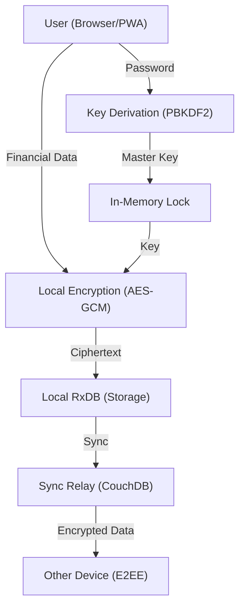

# ZakApp Architecture

ZakApp is built as a **Privacy-First, Local-First** financial platform. This document outlines the core architectural decisions and the flow of data.

## 1. Local-First Philosophy
Unlike traditional web applications where the server is the "Source of Truth," ZakApp treats the **client device** as the primary authority.

- **Primary Storage**: [RxDB](https://rxdb.info/) with a SQLite-WASM or IndexedDB storage.
- **Offline Capability**: The application is a Progressive Web App (PWA). All calculation logic (Zakat Fiqh engine) runs in the browser.
- **Benefits**:
  - Instant UI responsiveness (zero latency).
  - Works anywhere, even without internet.
  - Complete control over your data.

## 2. Security & End-to-End Encryption (E2EE)
ZakApp implements a "Zero-Knowledge" model. The server (Sync Relay) never sees your unencrypted financial values.

### The Encryption Flow
1. **Key Derivation**: On login, a 256-bit encryption key is derived from the user's password using PBKDF2 with 600,000 iterations and a unique salt.
2. **Local Encryption**: Before saving to RxDB, sensitive fields (e.g., asset balances, gold weights) are encrypted using AES-GCM (Web Crypto API).
3. **Encrypted Sync**: The encrypted data is synchronized with a CouchDB instance. Since the server lacks the user's password, it cannot decrypt the data.
4. **Key Management**: The encryption key resides only in the application's RAM during a session. It is never stored in `localStorage` or sent to the backend.

## 3. Zakat Engine (Fiqh Engine)
The core logic resides in `client/src/core/calculations/`. It is built for:
- **Precision**: Uses `BigNumber.js` for all financial math to avoid floating-point errors.
- **Extensibility**: Support for multiple Madhabs (Hanafi, Shafi'i, Maliki, Hanbali) via a rules-based strategy pattern.
- **Transparency**: Every rule implementation is unit-tested against recognized scholarly verdicts.

## 4. Technical Stack
- **Frontend**: React 18, Vite, Tailwind CSS, shadcn/ui.
- **Database**: RxDB (local), CouchDB (optional sync).
- **Backend (Optional Sync Gateway)**: Express.js, Prisma (for managing user accounts and sync metadata, but NOT financial data).

## 5. Deployment
ZakApp can be deployed as:
1. **Standalone PWA**: Hosting only the static files (e.g., GitHub Pages, Vercel).
2. **Full Stack**: Using the provided Docker Compose setup for a private sync server.
